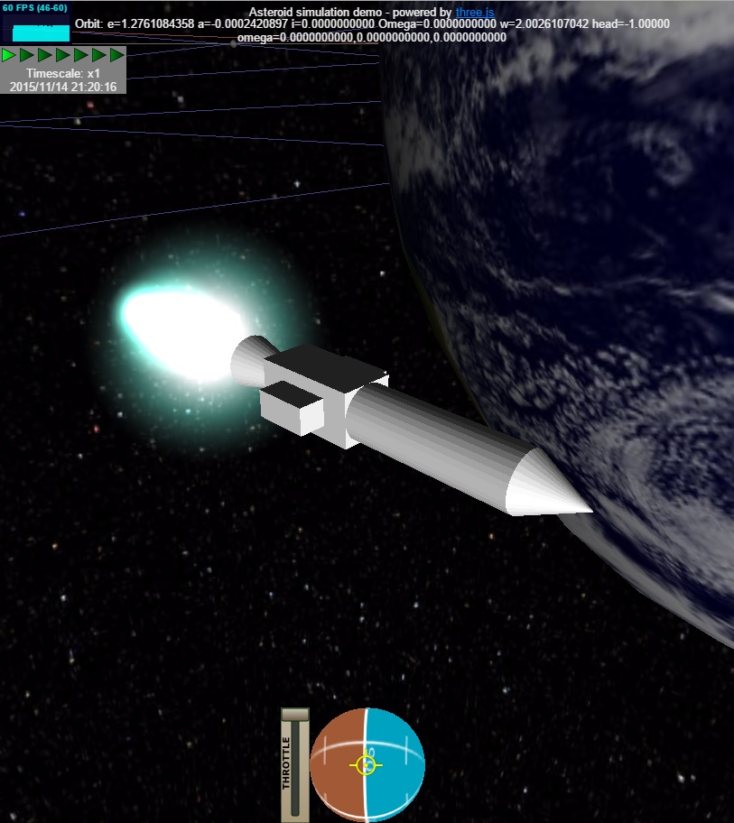

# WebGL-Orbiter

An orbit simulator with Newtonian dynamics which can be manipulated like
amazing game Kerbal Space Program.

Try it now on your browser!

http://msakuta.github.io/WebGL-Orbiter/orbiter.html

## Screenshots

## Controls

* '+' key increases simulation speed of time
* '-' key decreases simulation speed of time
* 'W' key rotates the vehicle upward
* 'S' key rotates the vehicle downward
* 'A' key rotates the vehicle left
* 'D' key rotates the vehicle right
* 'Q' key rotates the vehicle counterclockwise
* 'E' key rotates the vehicle clockwise
* 'Z' key sets the throttle to maximum
* 'X' key sets the throttle to zero (halts the engine)
* Shift key gradually increases throttle
* Ctrl key gradually decreases throttle
* 'H' key toggles camera chase mode
* 'G' key toggles grids

## Sources

* orbiter.html

  The real-time orbital simulator with three.js and WebGL.
  You'll need a WebGL supporting browser in order to enable this simulation.

* runge-kutta.html  

  Formulation of methods used for simulation steps.  Euler method and Runge-Kutta method
  are presented.  You'll need a decent browser with JavaScript support to see the formula.

## Libraries

This project uses three.js JavaScript library for rendering.
